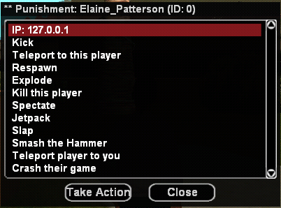
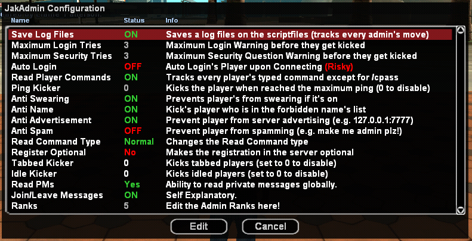

<h1 align="center">JakAdmin | 100+ available commands | SQLITE + YINI | Rich in features</h1>

<p align="center">
    
</p>

<h3 align="center">* Hello, this administration system made by JaKe Elite is exactly as written, without any modifications, and currently available in version 4.0 of the archived SA-MP forum. In addition, all the documentation and code is exactly as written by JaKe Elite</h3>


<h3 align="center">JaKe's Admin System 4.0</h3>

<h3 align="center">Last Updated: January 1, 2018</h3>


## Difference between JakAdmin4 & JakAdmin3

<h3 align="center">- If you use JakAdmin3, read the following -</h3>

With this thread being separated from **JakAdmin3**, there is nothing much changed between those scripts except that the folder for **JakAdmin** over `scriptfiles` was renamed instead of having `"JakAdmin3"` as the folder name it was renamed to `"JakAdmin"`. 

The include was also renamed from `jadmin3.inc` to `jadmin.inc`.
Please make sure to update the scripts that uses `jadmin3.inc`!

The `.pwn` name file for **JakAdmin4** was also renamed from `jadmin3.pwn` to `jadmin.pwn`

This script is much more optimized than **JakAdmin3**.  
The **VIP System** was completely removed from the script, making it a _standalone admin script_ once again.  

## Index
- [Difference between JakAdmin4 & JakAdmin3](#difference-between-jakadmin4--jakadmin3)
- [Features](#features)
- [Player Commands](#player-commands)
- [Admin Commands](#admin-commands)
  - [Level 1 Admin Commands](#level-1-admin-commands)
  - [Level 2 Admin Commands](#level-2-admin-commands)
  - [Level 3 Admin Commands](#level-3-admin-commands)
  - [Level 4 Admin Commands](#level-4-admin-commands)
  - [Level 5 Admin Commands](#level-5-admin-commands)
- [Admin Panel](#admin-panel)
- [Configuration](#configuration)
- [Script Configuration](#script-configuration)
- [Making Yourself a Level 5 Admin](#making-yourself-a-level-5-admin)
- [Installing](#installing)
  - [Windows](#windows)
  - [Linux](#linux)
- [Script Compatibility](#script-compatibility)
  - [Available Functions](#available-functions)
- [Private Message Detection](#private-message-detection)
- [Using jadmin.inc](#using-jadmininc)
- [Special Thanks To](#special-thanks-to)
  - [Beta Testers (Past & Present)](#beta-testers-past--present-thank-you)
- [Changelog](#changelog)
- [Download](#download)
- [Original](#original)

## Features
- SQLite + y_ini support  
- Vote Kick System  
- Safe RCON Protection  
- Private Messaging System  
- 3D Text Labels deployment  
- Whirlpool password hashing  
- Security question for account recovery  
- Tracking of last 10 IPs used by a player  
- In-game configurable settings  
- Script compatibility via `jadmin.inc`  
- Editable admin ranks in-game  
- 100+ commands for players & admins  
- Improved ban system (temporary bans included)  
- Built-in anti-server advertisement system  
- High-level admins immune to lower-level commands  
- AFK/Tabbed player detection  
- Breach system (logs IPs attempting account access)  

---

## Player Commands
- `/stats` → Displays player's statistics (Level 1+ admins can view others).  
- `/cpass` → Change your account password.  
- `/register` → Register your name and create an account.  
- `/login` → Login to your account.  
- `/report` → Report a player to online administrators.  
- `/admins` → List all online administrators (excluding hidden ones).  
- `/jcredits` → Show credits for JakAdmin contributors.  
- `/savestat` → Save your statistics.  
- `/cquestion` → Change your account’s security question and answer.  
- `/votekick` → Start a vote kick against a player.  
- `/yes` → Vote YES in an ongoing votekick poll.  
- `/no` → Vote NO in an ongoing votekick poll.  
- `/givechocolate` → Give a chocolate bar to a player.  
- `/pm` → Send a private message to a player.  
- `/togpm` → Enable/Disables from receiving Private Message (+ restricting you from using /pm as well).  
- `/id` *[getid]* → Search for a player by partial name.  

---


## Admin Commands

### Level 1 Admin Commands
- `/announce` → Display a game text message to everyone.  
- `/kick` → Kick a player from the server.  
- `/asay` → Send a chat message with admin prefix.  
- `/settime` → Set a player's game time.  
- `/setweather` → Set a player's game weather.  
- `/goto` → Teleport to a player.  
- `/ip` → Display a player's IP address.  
- `/spawn` → Respawn a player.  
- `/gotoco` → Teleport to specific coordinates.  
- `/flip` → Flip a vehicle by ID.  
- `/warn` → Warn a player.  
- `/remwarn` → Remove the most recent warning.  
- `/addnos` → Add nitrous to a player's vehicle.  
- `/repair` → Repair a player's vehicle.  
- `/reports` → List all pending player reports.  
- `/handlereport` → Handle a pending report.  
- `/denyreport` → Close and deny a pending report.  
- `/endreport` → End a report you are handling.  
- `/reporttalk` → Communicate with the reporter.  
- `/aduty` → Toggle admin duty mode.  
- `/weaps` → List a player's weapons.  
- `/votekicktime` → Set duration for votekick polls.  
- `/endvotekick` → End an ongoing votekick poll.  
- `/setwanted` → Set a player's wanted level.  
- `/setdlevel` → Set a player's drunk level.  
- `/entercar` → Enter a vehicle.  
- `/saveskin` → Save a skin ID for respawn.  
- `/useskin` → Use a saved skin.  
- `/checkdamage` → Check last 5 players who damaged a target.  
- `/tabbed` → List all tabbed-out players.  
- `/afk` → List all AFK players.  
- `/richlist` → Show top 5 richest players.  
- `(/o)aka` → Check if a player used other names recently.  
- `/god` → Make yourself invulnerable.  
- `/hideme` → Hide from `/admins` list.  
- `/laston` → Show last login time of a player.  
- `/ostats` → Display statistics of an offline player.  

---

### Level 2 Admin Commands
- `/disarm` → Remove all weapons from a player.  
- `/explode` → Trigger a loud explosion at a player's position (visible only to them).  
- `/setinterior` → Change a player's interior (default: 0).  
- `/setworld` → Change a player's virtual world (default: 0).  
- `/heal` → Heal a player.  
- `/armour` → Give full armor to a player.  
- `/clearchat` → Clear the server chat.  
- `/setskin` → Change a player's skin.  
- `/mute` → Mute a player from chat.  
- `/unmute` → Unmute a player.  
- `/akill` → Kill a player.  
- `/spec` → Spectate a player (`/spec off` to disable).  
- `/car` → Spawn a specific vehicle.  
- `/carcolor` → Change a vehicle's color.  
- `/eject` → Remove a player from a vehicle.  
- `/setvhealth` → Set a vehicle's health.  
- `/givecar` → Spawn a vehicle for a player.  
- `/muted` → List all muted players.  
- `/jailed` → List all jailed players.  
- `/jail` → Jail a player for a set time.  
- `/unjail` → Release a player from jail.  
- `/aweapons` → Spawn admin weapons.  
- `/jetpack` → Deploy a jetpack (can also give to players).  
- `/carpjob` → Change a vehicle's paintjob.  
- `/addlabel` → Create a 3D text label.  
- `/destroylabel` → Destroy a 3D text label.  
- `/gotolabel` → Teleport to a 3D text label.  
- `/radiusrespawn` → Respawn vehicles within a radius.  
- `/respawncar` → Respawn a specific vehicle.  
- `/ips` → Show last 10 IPs used by a player.  
- `/checkbreach` → Show last 10 IPs that attempted to access a player's account.  
- `/cage` → Deploy a cage around a player (visible only to them).  
- `/uncage` → Remove a player from a cage.  
- `/caged` → List all players currently caged.  

---

### Level 3 Admin Commands
- `/setmoney` → Set a player's money.  
- `/setscore` → Set a player's score.  
- `/setcolor` → Set a player's name color.  
- `/slap` → Slap a player.  
- `/cname` → Change a player's account name.  
- `/banip` → Ban a player's IP.  
- `/unbanip` → Unban a player's IP.  
- `/giveweapon` → Give a weapon to a player.  
- `/freeze` → Freeze a player from moving.  
- `/unfreeze` → Unfreeze a player.  
- `/getall` → Teleport all players to your location.  
- `/bankrupt` → Reset a player's money to zero.  
- `/teleplayer` → Teleport a player to another player.  
- `/destroycar` → Destroy a player-spawned vehicle.  
- `/sethealth` → Set a player's health.  
- `/setfstyle` → Set a player's fighting style.  
- `/healall` → Heal all players.  
- `/armourall` → Give armor to all players.  
- `/force` → Force a player back to class selection.  
- `/write` → Send a message to the chat.  
- `/get` → Teleport a player to your position.  
- `/oban` → Offline ban a player.  
- `/forbidword` → Add a forbidden word (auto-censored if AntiSwear is ON).  
- `/crash` → Crash a player's game.  
- `/setvotekicklimit` → Set required votes for a votekick.  
- `/hidemarker` → Hide a player's map marker.  
- `/setchocolate` → Set a player's chocolate bar count.  
- `/checkban` → Check if a player is banned.  
- `/jconfig` → Display current JakAdmin configuration settings.  

---

### Level 4 Admin Commands
- `/saveallstats` → Save all players' statistics.  
- `/cleardwindow` → Clear the death window.  
- `/respawncars` → Respawn all unoccupied vehicles.  
- `/setallweather` → Set weather for all players.  
- `/setalltime` → Set time for all players.  
- `/giveallweapon` → Give a weapon to all players.  
- `/giveallcash` → Give cash to all players.  
- `/giveallscore` → Give score to all players.  
- `/kickall` → Kick all players from the server.  
- `/disarmall` → Remove all players' weapons.  
- `/mutecmd` → Mute a player from using commands.  
- `/unmutecmd` → Unmute a player from using commands.  
- `/setallskin` → Set skin for all players.  
- `/fakedeath` → Display a fake death message.  
- `/cmdmuted` → List all players muted from using commands.  
- `/lockchat` → Enable/disable the chat globally.  
- `/gmx` → Restart the server.  
- `/setonline` → Set a player's total online time.  
- `/jsettings` → Change JakAdmin configuration.  
- `/setpass` → Set a player's account password.  
- `/giveallchocolate` → Give chocolate to all players.  
- `/reloadcfg` → Reload JakAdmin configuration files.  

---

### Level 5 Admin Commands
- `/setlevel` → Promote/demote a player to a specific admin level.  
- `/settemplevel` → Temporarily promote/demote a player to a specific admin level.  
- `/fakechat` → Send a fake chat message under a player's name.  
- `/fakecmd` → Execute a command using a player.  
- `/removeacc` → Remove a player account.  
- `/makemegodadmin` → Instantly promote yourself to Level 5 admin (RCON only).  
- `/createaccount` → Create a player account.  
- `/setaccount` → Change a player's account statistics.  
- `/rcons` → List all players currently logged into RCON.  

---

## Admin Panel
Double-click a player's name to open the **admin panel dialog**.  
This provides a quick way to execute actions on a player.  
Players can also use the dialog to report another player.

<p align="center">
    
</p>

---

## Configuration

### config.ini
Located inside the **JakAdmin** folder.  
Values can be modified directly in-game using `/jsettings`.

```pawn
RegisterOptional    - Makes the registration optional (0 = Disable, 1 = Enable)
SaveLog             - Save log files over the Log Folder inside JakAdmin folder (0 = Disable, 1 = Enable)
LoginWarn           - Amount of warnings before player gets kicked for having too many attempts to login to their account.
SecureWarn          - Amount of warnings before player gets kicked for having too many attempts on answering security question.
AutoLogin           - Automatically logs in players when they connect. (0 = Disable, 1 = Enable)
ReadCmds            - Read Command Mode (1 = Spectate Mode, you can only read used commands from the player that you spectate, 2 = Normal Mode, you can read everyone's used commands)
ReadCmd             - Read player's used commands (0 = Disable, 1 = Enable)
MaxPing             - The maximum ping that is allowed in the server (0 = Disable)
AntiSwear           - Censor words that is in the ForbiddenWords.cfg (0 = Disable, 1 = Enable)
AntiName            - Kicks players that uses the name that is listed in ForbiddenNames.cfg (0 = Disable, 1 = Enable)
AntiAd              - Alerts administrators when someone types an IP address. (0 = Disable, 1 = Enable)
AntiSpam            - Temporarily blocks player from executing commands/talking in the chat to prevent spam. (0 = Disable, 1 = Enable)
TabTime             - The maximum amount of time when player is tabbed, exceeding this amount of time will kick the player. (0 = Disable)
AFKTime             - The maximum amount of time when player is idle/AFK, exceeding this amount of time will kick the player. (0 = Disable)
ReadPMs             - Read player's private messages (0 = Disable, 1 = Enable)
LockChat            - Opens/Locks the chat in general (0 = Open, 1 = Close)
JoinMsg             - Sends out a message to everyone that a player has joined/left the server. (0 = Disable, 1 = Enable)
AdminRank1          - Admin Rank #1 name
AdminRank2          - Admin Rank #2 name
AdminRank3          - Admin Rank #3 name
AdminRank4          - Admin Rank #4 name
AdminRank5          - Admin Rank #5 name
```
<p align="center">
    
</p>

### Script Configuration

Configuration values that can be edited directly in the script.  
Default values:

```c
// Starting score for registered player.
#define                STARTING_SCORE                 1
// Starting cash for registered player.
#define                STARTING_CASH                  10000
// Max warnings for attempting to logged in RCON.
#define                MAX_RCON_WARNINGS              3
// Time Limit before you can send another message (in seconds).
#define                SPAM_TIMELIMIT                 2
// Maximum Notes an admin can drop to a specific player.
#define                MAX_NOTES                      3
// Maximum Deployable Labels
#define                MAX_DEPLOYABLE_LABEL           30
// Enables DIALOG in register/login/stats/everything, remove or comment otherwise to make it client-server message.
#define                USE_DIALOG
// Enables the 2nd RCON protection, remove or comment otherwise to disable.
#define                USE_RCON_PROTECTION
// Password for the 2nd RCON
#define                RCON_PASSWORD                  "changeme"
// Enables the AKA system, remove or comment otherwise to disable.
#define                USE_AKA
// Enables the command printing/logging on the server console, remove or comment to disable.
#define                PRINT_CMD
```
## Making Yourself a Level 5 Admin

Follow these steps to become a Level 5 Admin:

1. Connect to the server, register, and login.  
2. Login to RCON:
 ```
 /rcon login [rcon_password]
 ```
3. If the `SAFE RCON PROTECTION` is enabled, the default password for it is "`changeme`", type it over the popped-up dialog.
4. Type `/makemegodadmin`.

## Installing

To install JaKe's Admin System 4.0:

1. **Download the script.**
2. Copy and paste the folders to their respective destinations.  
   *(Choose the "COPY AND REPLACE" option when prompted.)*
3. Open `server.cfg` and edit the following lines:
 - Add `jadmin` next to the `filterscript`
 - Add these next to plugins "`streamer sscanf whirlpool`" (without the quotes)
 - If you are using `Linux`, put a `.so` at the end of each `plugin's` name when putting them on `server.cfg`.
4. Final Result of `server.cfg` (`filterscript` & `plugins`)

### Windows
```pawn
filterscripts jadmin
plugins streamer sscanf whirlpool
```

### Linux
```pawn
filterscripts jadmin
plugins streamer.so sscanf.so whirlpool.so
```

## Script Compatibility

If you are planning to use **JakAdmin4** as your admin system, you can link your script to **JakAdmin4** without porting the whole admin system to your `gamemode`. Just simply use the `jadmin3.inc`, These are the following functions that you can use on `jadmin3.inc`

### Available Functions
```pawn
native SetPlayerGameTime(playerid, hour, minute, second);
native GetPlayerGameTime(playerid, &hour, &minute, &second);
native SetPlayerChocolate(playerid, amount);
native GetPlayerChocolate(playerid);
native CheckLogin(playerid);
native SetPlayerLogged(playerid, toggle);
native SavePlayer(playerid);
native CheckAdmin(playerid);
native SetPlayerAdmin(playerid, level);
native CheckPlayerMute(playerid);
native CheckPlayerMuteSecond(playerid);
native CheckPlayerCMute(playerid);
native CheckPlayerCMuteSecond(playerid);
native SetPlayerMute(playerid, toggle);
native SetPlayerMuteSecond(playerid, seconds);
native SetPlayerCMuteSecond(playerid, seconds);
native CheckPlayerJail(playerid);
native CheckPlayerJailSecond(playerid);
native SetPlayerJail(playerid, toggle);
native SetPlayerJailSecond(playerid, seconds);
native CheckAccountID(playerid);
native CheckPlayerWarn(playerid);
native SetPlayerWarn(playerid, warn);
native CheckPlayerKills(playerid);
native SetPlayerKill(playerid, kill);
native CheckPlayerDeaths(playerid);
native SetPlayerDeath(playerid, death);
native IsPlayerIdle(playerid);
native IsPlayerTabbed(playerid);
```

## Private Message Detection

You can also use/detect if a player has sent a private message to another player using the following callback:

```pawn
public OnPlayerPrivMessage(playerid, id, text[])
```

## Using jadmin.inc

### How to create an admin command
You can create an admin command by using the **CheckAdmin** function.  
Below is an example of how to use it:

```pawn
CMD:mycommand(playerid, params[])
{
    LoginCheck(playerid); // Check if the player is logged in.
    LevelCheck(playerid, 1); // Require Level 1 admin (change 1 to any level from 1 to 5).

    // Place your script code here.
    return 1;
}
```

## Special Thanks To

- **Jake Hero** – Coding/Scripting JakAdmin4  
- **Zeex** – zcmd  
- **Y_Less** – sscanf / YSI / whirlpool  
- **Lordzy** – Safe RCON Protection  
- **denNorske** – Providing a temporary server-host  
- **Stinged** – RCON Command technique  
- **Emmet_** – easyDialog  

### Beta Testers (Past & Present, Thank You!)
Milica, NotDunn, Kizuna, YaBoiJeff (Sean), Pavintharan, denNorske, Uberanwar,  
Ranveer, Harvey, Ultraz Samp_India, Ashirwad, Sonic, Adham, MaxFranky  

---

## Changelog

### Changes since 3.5 of JakAdmin  
**Version 4.0**

- Script Optimization.  
- Updated `jadmin.inc` (renamed from `jadmin3`).  
- Ban System tweaked:  
  - Offline banning now bans the IP.  
  - Added a Temporary Ban System (no effects on previous ban database).  
  - Added `/checkban` command to check if a player is banned.  
  - Added `/banip` and `/unbanip` commands.  
- Security checks on user accounts.  
- Prints out a log at the server console whenever a player fails to login/answer the security question.  
- `/checkbreach` lists last 10 IPs attempting account access.  
- Level 5 admins:  
  - `/createaccount` to create user accounts without logging out.  
  - `/removeaccount` to delete accounts.  
  - `/setaccount` for full control of offline accounts.  
- Server will now automatically kick tabbed out/idle players (`/jsettings` to disable).  
- Added `/tabbed` and `/afk` commands.  
- Idle/Tabbed checks (`IsPlayerTabbed`, `IsPlayerIdle`).  
- Removed Note System and Mega Jump System.  
- Removed a few commands that is prone to being abused.  
- Added `/laston` command.  
- Re-added `/lockchat`.  
- Higher admins immune from global commands like `/setallskin`.  
- Added `/rcons` for Level 5+.  
- Re-added `/hideme`.  
- Added admin labels.  
- Added join/leave messages (`/jsettings`).  
- `/god` moved to Level 1 admin.  
- Switched from dini to y_ini.  
- Changed color theme from Orange → Green.  
- You can now permanently mute players without setting a time.  
- Added damage check (last 5 attackers).  
- Added `/richlist` command.  
- Re-added private message system.  
- Option to make `/stats` dialog or client message (`USE_DIALOG`).  
- Converted dialogs to Emmet's easyDialog.  
- Added Also-Known-As system (`USE_AKA`).  
- Tweaked the Anti-Spam (+ now includes Command Spams).  
- Admin status displayed in `/stats`.  
- Fixed advanced/reverse spectating.  
- Added `/ostats` for offline statistics.  
- Client messages & colors re-tweaked (grammar fixes included).  
- Added cage system (`/cage`, `/uncage`, `/caged`).  
- Fixed `/register` crash bug.  
- Enables to print out all the players typed command on the server console (`PRINT_CMD`).  
- `/gotoco` now requires commas in coordinates.  
- RCON Panel control (promote/demote without IG, etc).  
- Removal of the High-Ping Warning, player gets instantly kicked now for having a high ping.  
- VIP system removed → JakAdmin is now standalone.  

---

## Download

**Version 4.0 (01/01/18)**  
**Fixed Files**  

[Download](https//)

## Original

- [[FilterScript] JakAdmin | 100 available commands | SQLITE YINI | Rich in features - SA-MP Forum Filterscripts](https://filterscripts1.rssing.com/chan-64791385/article322-live.html)
- [Download - Original](https://www.mediafire.com/file/v3rrd6ogftb9m2m/JakAdmin4.rar)
